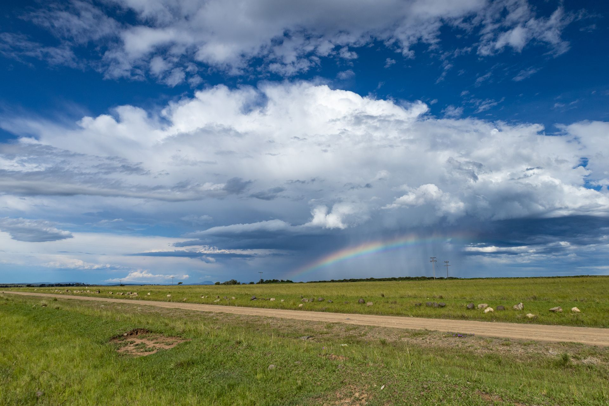

# Weathif



**Weathif** is an interactive climate scenario simulator that combines current weather, historical climate context, seasonal outlooks, land and water conditions, global ENSO signals, and hypothetical temperature and rainfall scenarios in one visual environmental experience.

Users can search a real location, explore its environmental baseline, compare recent conditions with historical patterns, examine broader climate signals, and experiment with transparent climate scenarios.

### Live Project

**Website:** https://weathif.vercel.app  
**API:** https://weathif-api.vercel.app

---

## What Weathif Does

Weathif moves beyond a standard weather forecast by building several layers of environmental context around a real location.

### Current Environmental Baseline

Search a location to retrieve:

- Current temperature
- Feels-like temperature
- Humidity
- Atmospheric pressure
- Wind speed
- Cloud cover
- Weather conditions
- Recent 30-day rainfall

### Interactive Geographic Context

Users can:

- Search locations by name
- View the selected location on an interactive map
- Click the map to explore another location
- Reverse-geocode map coordinates into place information

### Climate Memory

Recent conditions are compared with the same seasonal period across the previous 10 completed years.

The simulator visualises:

- Recent mean temperature
- Historical same-period temperature
- Temperature difference
- Recent rainfall
- Historical rainfall
- Rainfall percentage difference

This provides historical context rather than a formal climate normal.

### Seasonal Outlook

Weathif displays monthly seasonal anomaly signals from the ECMWF SEAS5 model through Open-Meteo.

Separate visualisations show:

- Temperature anomalies
- Precipitation anomalies
- Warmer or cooler tendencies
- Wetter or drier tendencies

These are broad seasonal model signals, not precise local forecasts.

### ENSO Climate Context

The simulator retrieves current ENSO information from NOAA, including:

- ENSO phase
- Advisory status
- Niño 3.4
- Oceanic Niño Index (ONI)
- Multivariate ENSO Index (MEI V2)
- Official NOAA outlook

ENSO is presented as global climate context and is not treated as a deterministic predictor of weather at a specific location.

### Land & Water Conditions

Additional environmental indicators include:

- Surface soil moisture
- Root-zone soil moisture
- Surface soil temperature
- Soil temperature at depth
- Vapour pressure deficit
- Reference evapotranspiration

### Climate Scenario Lab

Users can modify:

- **Temperature:** -5°C to +5°C
- **Rainfall:** -100% to +100%

The interface previews the altered climate state in real time before sending the scenario to the backend.

The Python scenario engine then evaluates transparent environmental thresholds and returns contextual indicators.

---

## Architecture

Weathif uses a separated frontend and backend architecture.

```text
User
 │
 ▼
React + Vite Frontend
weathif.vercel.app
 │
 │ REST API
 ▼
FastAPI + Python Backend
weathif-api.vercel.app
 │
 ├── OpenWeatherMap
 ├── Open-Meteo
 ├── ECMWF SEAS5
 ├── NOAA
 ├── Nominatim
 └── OpenStreetMap
```

The frontend is responsible for interaction and visualisation, while the backend handles environmental calculations, external service requests, validation, and API orchestration.

Private API credentials remain server-side.

---

## Technology

### Frontend

- React
- JavaScript
- Vite
- React Router
- Recharts
- React Leaflet
- Leaflet
- HTML
- CSS
- Responsive Design
- Accessible interaction states

### Backend

- Python
- FastAPI
- Uvicorn
- Requests
- Beautiful Soup
- Geopy
- python-dotenv
- REST API architecture

### Data & Services

- OpenWeatherMap
- Open-Meteo
- ECMWF SEAS5
- NOAA Climate Prediction Center
- NOAA Physical Sciences Laboratory
- Nominatim
- OpenStreetMap

### Deployment

- Vercel
- GitHub

---

## Project Structure

```text
weathif/
│
├── backend/
│   ├── services/
│   │   ├── climate_memory.py
│   │   ├── enso.py
│   │   ├── environment.py
│   │   ├── geocoding.py
│   │   ├── scenario.py
│   │   ├── seasonal_outlook.py
│   │   ├── simulation.py
│   │   └── weather.py
│   │
│   ├── .env.example
│   ├── main.py
│   └── requirements.txt
│
├── frontend/
│   ├── public/
│   │   ├── images/
│   │   ├── videos/
│   │   └── logo.png
│   │
│   ├── src/
│   │   ├── assets/
│   │   ├── components/
│   │   ├── pages/
│   │   ├── services/
│   │   └── styles/
│   │
│   ├── index.html
│   ├── package.json
│   ├── vercel.json
│   └── vite.config.js
│
├── .gitignore
└── README.md
```

---

## Main Pages

### `/`

A visual introduction to Weathif, its environmental layers, climate concepts, and scenario simulator.

### `/simulator`

The complete interactive climate workspace.

### `/methodology`

Explains how Weathif retrieves, compares, and interprets environmental data, including the limitations of the simulator.

### `/technology`

Documents the application architecture, technical stack, request lifecycle, and engineering decisions behind the project.

---

## API Endpoints

The FastAPI backend exposes endpoints for the major application services.

```text
GET  /api/health
GET  /api/geocode
GET  /api/reverse-geocode
GET  /api/weather
GET  /api/environment
GET  /api/climate-memory
GET  /api/seasonal-outlook
GET  /api/enso

POST /api/scenario
POST /api/simulate
```

Example:

```text
https://weathif-api.vercel.app/api/health
```

---

## Running Locally

### 1. Clone the repository

```bash
git clone <repository-url>
cd weathif
```

### 2. Backend

```bash
cd backend
python -m venv .venv
```

Activate the environment.

Windows:

```bash
.venv\Scripts\activate
```

Install dependencies:

```bash
pip install -r requirements.txt
```

Create:

```text
backend/.env
```

Add:

```env
OWM_API_KEY=your_openweathermap_api_key
```

Start FastAPI:

```bash
uvicorn main:app --reload
```

Backend:

```text
http://127.0.0.1:8000
```

API documentation:

```text
http://127.0.0.1:8000/docs
```

### 3. Frontend

Open another terminal:

```bash
cd frontend
npm install
npm run dev
```

Frontend:

```text
http://localhost:5173
```

The development frontend defaults to the local FastAPI server when no production API URL is configured.

---

## Environment Variables

### Backend

```env
OWM_API_KEY=
```

The real key must never be committed to Git.

### Frontend

Production uses:

```env
VITE_API_BASE_URL=https://weathif-api.vercel.app
```

The API URL is public configuration and contains no private credentials.

---

## Data Transparency

Weathif deliberately distinguishes between different kinds of environmental information.

- Current weather is observational/API weather data.
- Recent rainfall is a rolling recent-period baseline.
- Climate Memory is a same-season historical comparison.
- Seasonal Outlook values are model anomalies.
- Soil and evapotranspiration values are modelled environmental data.
- ENSO represents large-scale Pacific climate context.
- Scenario results are application-defined hypothetical calculations.

No failed API request is silently replaced with invented climate values.

---

## Scientific Boundaries

Weathif is an **exploratory climate scenario simulator**.

It is not:

- A numerical climate model
- A meteorological warning system
- A disaster prediction service
- An agricultural prescription tool
- A substitute for professional scientific analysis

Scenario thresholds are intentionally transparent and are designed for exploration rather than forecasting.

---

## Engineering Evolution

Weathif began as a Python Streamlit prototype.

The project was later rebuilt into a separated **React + FastAPI application** to improve:

- Frontend architecture
- Responsive design
- Data visualisation
- API security
- Separation of concerns
- Error handling
- Maintainability
- Deployment architecture
- User experience

The completed application keeps Python responsible for environmental logic while React handles the interactive product experience.

---

## Design

The visual direction draws from environmental observation, climate research, land systems, atmospheric imagery, and scientific data interfaces.

The interface uses:

- Environmental photography
- Interactive mapping
- Climate charts
- Historical comparisons
- Ocean-inspired ENSO visualisation
- Land and soil visual language
- Responsive desktop and mobile layouts

The goal is to make environmental information understandable without presenting uncertainty as certainty.

---

## Author

Built as a **Git It Bunny** project.

---

## License

This project is intended for portfolio and educational use.